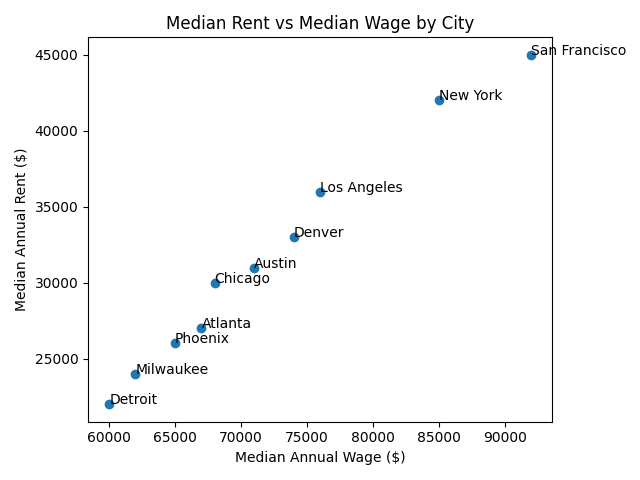
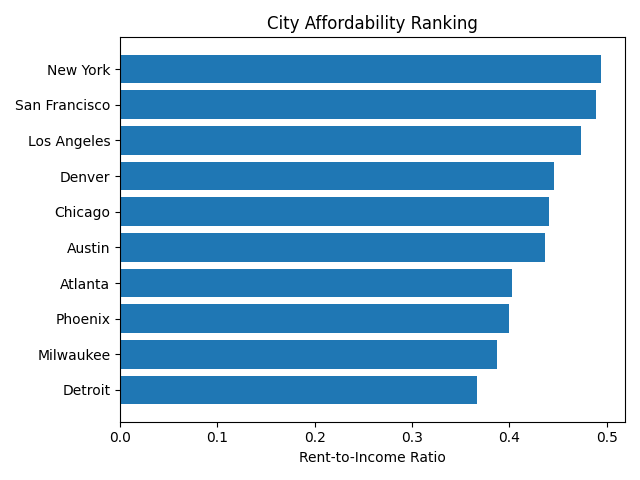

# City Affordability Analysis

## Overview
This project analyzes housing affordability across selected U.S. cities by comparing
median wages and median rent levels. The goal is to evaluate how realistic urban living
is for a typical worker in different metro areas.

## Motivation
Economic discussions often emphasize wage growth, but housing costs play a critical
role in determining quality of life. This project focuses on rent as a share of income
to provide a practical affordability perspective.

## Dataset
The dataset contains estimated city-level values for:
- Median annual wages
- Median annual rent

Cities were chosen to represent a mix of large, mid-sized, and more affordable metros.
The data is used for analytical demonstration purposes.

## Methodology
- Calculated a rent-to-income ratio for each city
- Ranked cities based on affordability
- Visualized relationships between wages and rent

## Key Findings
- High-wage cities often remain unaffordable due to high rent
- Mid-sized cities can offer better rent-to-income balance
- Milwaukee ranks among the more affordable cities in the sample

## Tools Used
- Python
- pandas
- matplotlib

## Files
- `analysis.py`: Data analysis and visualization code
- `city_data.csv`: City-level wage and rent data
## Visualizations

### Median Wage vs Rent

### City Affordability Ranking

